# ParseTreeGenerator
## *WIP*
From this
```c
int facto(int n)
{
    return n * facto(n - 1);
}
```

To this

```mermaid
    flowchart BT
    node2_0(["Starting"])
    node7_14(["INT"])
    node12_34(["type_specifier"])
    node19_32(["declaration_specifiers"])
    node23_51(["IDENTIFIER"])
    node28_58(["direct_declarator"])
    node33_131(["'('"])
    node38_14(["INT"])
    node43_34(["type_specifier"])
    node50_229(["declaration_specifiers"])
    node54_51(["IDENTIFIER"])
    node59_58(["direct_declarator"])
    node66_332(["declarator"])
    node72_232(["parameter_declaration"])
    node77_231(["parameter_list"])
    node83_230(["parameter_type_list"])
    node87_335(["')'"])
    node95_58(["direct_declarator"])
    node102_57(["declarator"])
    node106_125(["'{'"])
    node111_208(["RETURN"])
    node116_74(["IDENTIFIER"])
    node121_92(["primary_expression"])
    node126_96(["postfix_expression"])
    node133_150(["unary_expression"])
    node139_99(["cast_expression"])
    node144_100(["multiplicative_expression"])
    node148_162(["'*'"])
    node153_74(["IDENTIFIER"])
    node158_92(["primary_expression"])
    node163_96(["postfix_expression"])
    node168_158(["'('"])
    node173_74(["IDENTIFIER"])
    node178_92(["primary_expression"])
    node183_96(["postfix_expression"])
    node190_150(["unary_expression"])
    node196_99(["cast_expression"])
    node201_100(["multiplicative_expression"])
    node207_101(["additive_expression"])
    node211_166(["'-'"])
    node216_75(["I_CONSTANT"])
    node221_93(["constant"])
    node226_92(["primary_expression"])
    node231_96(["postfix_expression"])
    node238_97(["unary_expression"])
    node243_99(["cast_expression"])
    node248_281(["multiplicative_expression"])
    node256_101(["additive_expression"])
    node262_102(["shift_expression"])
    node268_103(["relational_expression"])
    node274_104(["equality_expression"])
    node280_105(["and_expression"])
    node286_106(["exclusive_or_expression"])
    node292_107(["inclusive_or_expression"])
    node298_108(["logical_and_expression"])
    node304_109(["logical_or_expression"])
    node310_151(["conditional_expression"])
    node315_274(["assignment_expression"])
    node320_273(["argument_expression_list"])
    node324_361(["')'"])
    node332_96(["postfix_expression"])
    node339_97(["unary_expression"])
    node344_277(["cast_expression"])
    node351_100(["multiplicative_expression"])
    node357_101(["additive_expression"])
    node363_102(["shift_expression"])
    node369_103(["relational_expression"])
    node375_104(["equality_expression"])
    node381_105(["and_expression"])
    node387_106(["exclusive_or_expression"])
    node393_107(["inclusive_or_expression"])
    node399_108(["logical_and_expression"])
    node405_109(["logical_or_expression"])
    node411_151(["conditional_expression"])
    node416_152(["assignment_expression"])
    node421_320(["expression"])
    node425_392(["';'"])
    node432_221(["jump_statement"])
    node437_213(["statement"])
    node442_217(["block_item"])
    node447_216(["block_item_list"])
    node452_322(["'}'"])
    node459_129(["compound_statement"])
    node466_45(["function_definition"])
    node471_44(["external_declaration"])
    node476_43(["translation_unit"])
    node7_14 --> node12_34
    node12_34 --> node19_32
    node19_32 --> node466_45
    node23_51 --> node28_58
    node28_58 --> node95_58
    node33_131 --> node95_58
    node38_14 --> node43_34
    node43_34 --> node50_229
    node50_229 --> node72_232
    node54_51 --> node59_58
    node59_58 --> node66_332
    node66_332 --> node72_232
    node72_232 --> node77_231
    node77_231 --> node83_230
    node83_230 --> node95_58
    node87_335 --> node95_58
    node95_58 --> node102_57
    node102_57 --> node466_45
    node106_125 --> node459_129
    node111_208 --> node432_221
    node116_74 --> node121_92
    node121_92 --> node126_96
    node126_96 --> node133_150
    node133_150 --> node139_99
    node139_99 --> node144_100
    node144_100 --> node351_100
    node148_162 --> node351_100
    node153_74 --> node158_92
    node158_92 --> node163_96
    node163_96 --> node332_96
    node168_158 --> node332_96
    node173_74 --> node178_92
    node178_92 --> node183_96
    node183_96 --> node190_150
    node190_150 --> node196_99
    node196_99 --> node201_100
    node201_100 --> node207_101
    node207_101 --> node256_101
    node211_166 --> node256_101
    node216_75 --> node221_93
    node221_93 --> node226_92
    node226_92 --> node231_96
    node231_96 --> node238_97
    node238_97 --> node243_99
    node243_99 --> node248_281
    node248_281 --> node256_101
    node256_101 --> node262_102
    node262_102 --> node268_103
    node268_103 --> node274_104
    node274_104 --> node280_105
    node280_105 --> node286_106
    node286_106 --> node292_107
    node292_107 --> node298_108
    node298_108 --> node304_109
    node304_109 --> node310_151
    node310_151 --> node315_274
    node315_274 --> node320_273
    node320_273 --> node332_96
    node324_361 --> node332_96
    node332_96 --> node339_97
    node339_97 --> node344_277
    node344_277 --> node351_100
    node351_100 --> node357_101
    node357_101 --> node363_102
    node363_102 --> node369_103
    node369_103 --> node375_104
    node375_104 --> node381_105
    node381_105 --> node387_106
    node387_106 --> node393_107
    node393_107 --> node399_108
    node399_108 --> node405_109
    node405_109 --> node411_151
    node411_151 --> node416_152
    node416_152 --> node421_320
    node421_320 --> node432_221
    node425_392 --> node432_221
    node432_221 --> node437_213
    node437_213 --> node442_217
    node442_217 --> node447_216
    node447_216 --> node459_129
    node452_322 --> node459_129
    node459_129 --> node466_45
    node466_45 --> node471_44
    node471_44 --> node476_43
    node476_43 --> node2_0
```


Or [image link](https://mermaid.ink/img/ICAgIGZsb3djaGFydCBCVAogICAgbm9kZTJfMChbIlN0YXJ0aW5nIl0pCiAgICBub2RlN18xNChbIklOVCJdKQogICAgbm9kZTEyXzM0KFsidHlwZV9zcGVjaWZpZXIiXSkKICAgIG5vZGUxOV8zMihbImRlY2xhcmF0aW9uX3NwZWNpZmllcnMiXSkKICAgIG5vZGUyM181MShbIklERU5USUZJRVIiXSkKICAgIG5vZGUyOF81OChbImRpcmVjdF9kZWNsYXJhdG9yIl0pCiAgICBub2RlMzNfMTMxKFsiJygnIl0pCiAgICBub2RlMzhfMTQoWyJJTlQiXSkKICAgIG5vZGU0M18zNChbInR5cGVfc3BlY2lmaWVyIl0pCiAgICBub2RlNTBfMjI5KFsiZGVjbGFyYXRpb25fc3BlY2lmaWVycyJdKQogICAgbm9kZTU0XzUxKFsiSURFTlRJRklFUiJdKQogICAgbm9kZTU5XzU4KFsiZGlyZWN0X2RlY2xhcmF0b3IiXSkKICAgIG5vZGU2Nl8zMzIoWyJkZWNsYXJhdG9yIl0pCiAgICBub2RlNzJfMjMyKFsicGFyYW1ldGVyX2RlY2xhcmF0aW9uIl0pCiAgICBub2RlNzdfMjMxKFsicGFyYW1ldGVyX2xpc3QiXSkKICAgIG5vZGU4M18yMzAoWyJwYXJhbWV0ZXJfdHlwZV9saXN0Il0pCiAgICBub2RlODdfMzM1KFsiJyknIl0pCiAgICBub2RlOTVfNTgoWyJkaXJlY3RfZGVjbGFyYXRvciJdKQogICAgbm9kZTEwMl81NyhbImRlY2xhcmF0b3IiXSkKICAgIG5vZGUxMDZfMTI1KFsiJ3snIl0pCiAgICBub2RlMTExXzIwOChbIlJFVFVSTiJdKQogICAgbm9kZTExNl83NChbIklERU5USUZJRVIiXSkKICAgIG5vZGUxMjFfOTIoWyJwcmltYXJ5X2V4cHJlc3Npb24iXSkKICAgIG5vZGUxMjZfOTYoWyJwb3N0Zml4X2V4cHJlc3Npb24iXSkKICAgIG5vZGUxMzNfMTUwKFsidW5hcnlfZXhwcmVzc2lvbiJdKQogICAgbm9kZTEzOV85OShbImNhc3RfZXhwcmVzc2lvbiJdKQogICAgbm9kZTE0NF8xMDAoWyJtdWx0aXBsaWNhdGl2ZV9leHByZXNzaW9uIl0pCiAgICBub2RlMTQ4XzE2MihbIicqJyJdKQogICAgbm9kZTE1M183NChbIklERU5USUZJRVIiXSkKICAgIG5vZGUxNThfOTIoWyJwcmltYXJ5X2V4cHJlc3Npb24iXSkKICAgIG5vZGUxNjNfOTYoWyJwb3N0Zml4X2V4cHJlc3Npb24iXSkKICAgIG5vZGUxNjhfMTU4KFsiJygnIl0pCiAgICBub2RlMTczXzc0KFsiSURFTlRJRklFUiJdKQogICAgbm9kZTE3OF85MihbInByaW1hcnlfZXhwcmVzc2lvbiJdKQogICAgbm9kZTE4M185NihbInBvc3RmaXhfZXhwcmVzc2lvbiJdKQogICAgbm9kZTE5MF8xNTAoWyJ1bmFyeV9leHByZXNzaW9uIl0pCiAgICBub2RlMTk2Xzk5KFsiY2FzdF9leHByZXNzaW9uIl0pCiAgICBub2RlMjAxXzEwMChbIm11bHRpcGxpY2F0aXZlX2V4cHJlc3Npb24iXSkKICAgIG5vZGUyMDdfMTAxKFsiYWRkaXRpdmVfZXhwcmVzc2lvbiJdKQogICAgbm9kZTIxMV8xNjYoWyInLSciXSkKICAgIG5vZGUyMTZfNzUoWyJJX0NPTlNUQU5UIl0pCiAgICBub2RlMjIxXzkzKFsiY29uc3RhbnQiXSkKICAgIG5vZGUyMjZfOTIoWyJwcmltYXJ5X2V4cHJlc3Npb24iXSkKICAgIG5vZGUyMzFfOTYoWyJwb3N0Zml4X2V4cHJlc3Npb24iXSkKICAgIG5vZGUyMzhfOTcoWyJ1bmFyeV9leHByZXNzaW9uIl0pCiAgICBub2RlMjQzXzk5KFsiY2FzdF9leHByZXNzaW9uIl0pCiAgICBub2RlMjQ4XzI4MShbIm11bHRpcGxpY2F0aXZlX2V4cHJlc3Npb24iXSkKICAgIG5vZGUyNTZfMTAxKFsiYWRkaXRpdmVfZXhwcmVzc2lvbiJdKQogICAgbm9kZTI2Ml8xMDIoWyJzaGlmdF9leHByZXNzaW9uIl0pCiAgICBub2RlMjY4XzEwMyhbInJlbGF0aW9uYWxfZXhwcmVzc2lvbiJdKQogICAgbm9kZTI3NF8xMDQoWyJlcXVhbGl0eV9leHByZXNzaW9uIl0pCiAgICBub2RlMjgwXzEwNShbImFuZF9leHByZXNzaW9uIl0pCiAgICBub2RlMjg2XzEwNihbImV4Y2x1c2l2ZV9vcl9leHByZXNzaW9uIl0pCiAgICBub2RlMjkyXzEwNyhbImluY2x1c2l2ZV9vcl9leHByZXNzaW9uIl0pCiAgICBub2RlMjk4XzEwOChbImxvZ2ljYWxfYW5kX2V4cHJlc3Npb24iXSkKICAgIG5vZGUzMDRfMTA5KFsibG9naWNhbF9vcl9leHByZXNzaW9uIl0pCiAgICBub2RlMzEwXzE1MShbImNvbmRpdGlvbmFsX2V4cHJlc3Npb24iXSkKICAgIG5vZGUzMTVfMjc0KFsiYXNzaWdubWVudF9leHByZXNzaW9uIl0pCiAgICBub2RlMzIwXzI3MyhbImFyZ3VtZW50X2V4cHJlc3Npb25fbGlzdCJdKQogICAgbm9kZTMyNF8zNjEoWyInKSciXSkKICAgIG5vZGUzMzJfOTYoWyJwb3N0Zml4X2V4cHJlc3Npb24iXSkKICAgIG5vZGUzMzlfOTcoWyJ1bmFyeV9leHByZXNzaW9uIl0pCiAgICBub2RlMzQ0XzI3NyhbImNhc3RfZXhwcmVzc2lvbiJdKQogICAgbm9kZTM1MV8xMDAoWyJtdWx0aXBsaWNhdGl2ZV9leHByZXNzaW9uIl0pCiAgICBub2RlMzU3XzEwMShbImFkZGl0aXZlX2V4cHJlc3Npb24iXSkKICAgIG5vZGUzNjNfMTAyKFsic2hpZnRfZXhwcmVzc2lvbiJdKQogICAgbm9kZTM2OV8xMDMoWyJyZWxhdGlvbmFsX2V4cHJlc3Npb24iXSkKICAgIG5vZGUzNzVfMTA0KFsiZXF1YWxpdHlfZXhwcmVzc2lvbiJdKQogICAgbm9kZTM4MV8xMDUoWyJhbmRfZXhwcmVzc2lvbiJdKQogICAgbm9kZTM4N18xMDYoWyJleGNsdXNpdmVfb3JfZXhwcmVzc2lvbiJdKQogICAgbm9kZTM5M18xMDcoWyJpbmNsdXNpdmVfb3JfZXhwcmVzc2lvbiJdKQogICAgbm9kZTM5OV8xMDgoWyJsb2dpY2FsX2FuZF9leHByZXNzaW9uIl0pCiAgICBub2RlNDA1XzEwOShbImxvZ2ljYWxfb3JfZXhwcmVzc2lvbiJdKQogICAgbm9kZTQxMV8xNTEoWyJjb25kaXRpb25hbF9leHByZXNzaW9uIl0pCiAgICBub2RlNDE2XzE1MihbImFzc2lnbm1lbnRfZXhwcmVzc2lvbiJdKQogICAgbm9kZTQyMV8zMjAoWyJleHByZXNzaW9uIl0pCiAgICBub2RlNDI1XzM5MihbIic7JyJdKQogICAgbm9kZTQzMl8yMjEoWyJqdW1wX3N0YXRlbWVudCJdKQogICAgbm9kZTQzN18yMTMoWyJzdGF0ZW1lbnQiXSkKICAgIG5vZGU0NDJfMjE3KFsiYmxvY2tfaXRlbSJdKQogICAgbm9kZTQ0N18yMTYoWyJibG9ja19pdGVtX2xpc3QiXSkKICAgIG5vZGU0NTJfMzIyKFsiJ30nIl0pCiAgICBub2RlNDU5XzEyOShbImNvbXBvdW5kX3N0YXRlbWVudCJdKQogICAgbm9kZTQ2Nl80NShbImZ1bmN0aW9uX2RlZmluaXRpb24iXSkKICAgIG5vZGU0NzFfNDQoWyJleHRlcm5hbF9kZWNsYXJhdGlvbiJdKQogICAgbm9kZTQ3Nl80MyhbInRyYW5zbGF0aW9uX3VuaXQiXSkKICAgIG5vZGU3XzE0IC0tPiBub2RlMTJfMzQKICAgIG5vZGUxMl8zNCAtLT4gbm9kZTE5XzMyCiAgICBub2RlMTlfMzIgLS0+IG5vZGU0NjZfNDUKICAgIG5vZGUyM181MSAtLT4gbm9kZTI4XzU4CiAgICBub2RlMjhfNTggLS0+IG5vZGU5NV81OAogICAgbm9kZTMzXzEzMSAtLT4gbm9kZTk1XzU4CiAgICBub2RlMzhfMTQgLS0+IG5vZGU0M18zNAogICAgbm9kZTQzXzM0IC0tPiBub2RlNTBfMjI5CiAgICBub2RlNTBfMjI5IC0tPiBub2RlNzJfMjMyCiAgICBub2RlNTRfNTEgLS0+IG5vZGU1OV81OAogICAgbm9kZTU5XzU4IC0tPiBub2RlNjZfMzMyCiAgICBub2RlNjZfMzMyIC0tPiBub2RlNzJfMjMyCiAgICBub2RlNzJfMjMyIC0tPiBub2RlNzdfMjMxCiAgICBub2RlNzdfMjMxIC0tPiBub2RlODNfMjMwCiAgICBub2RlODNfMjMwIC0tPiBub2RlOTVfNTgKICAgIG5vZGU4N18zMzUgLS0+IG5vZGU5NV81OAogICAgbm9kZTk1XzU4IC0tPiBub2RlMTAyXzU3CiAgICBub2RlMTAyXzU3IC0tPiBub2RlNDY2XzQ1CiAgICBub2RlMTA2XzEyNSAtLT4gbm9kZTQ1OV8xMjkKICAgIG5vZGUxMTFfMjA4IC0tPiBub2RlNDMyXzIyMQogICAgbm9kZTExNl83NCAtLT4gbm9kZTEyMV85MgogICAgbm9kZTEyMV85MiAtLT4gbm9kZTEyNl85NgogICAgbm9kZTEyNl85NiAtLT4gbm9kZTEzM18xNTAKICAgIG5vZGUxMzNfMTUwIC0tPiBub2RlMTM5Xzk5CiAgICBub2RlMTM5Xzk5IC0tPiBub2RlMTQ0XzEwMAogICAgbm9kZTE0NF8xMDAgLS0+IG5vZGUzNTFfMTAwCiAgICBub2RlMTQ4XzE2MiAtLT4gbm9kZTM1MV8xMDAKICAgIG5vZGUxNTNfNzQgLS0+IG5vZGUxNThfOTIKICAgIG5vZGUxNThfOTIgLS0+IG5vZGUxNjNfOTYKICAgIG5vZGUxNjNfOTYgLS0+IG5vZGUzMzJfOTYKICAgIG5vZGUxNjhfMTU4IC0tPiBub2RlMzMyXzk2CiAgICBub2RlMTczXzc0IC0tPiBub2RlMTc4XzkyCiAgICBub2RlMTc4XzkyIC0tPiBub2RlMTgzXzk2CiAgICBub2RlMTgzXzk2IC0tPiBub2RlMTkwXzE1MAogICAgbm9kZTE5MF8xNTAgLS0+IG5vZGUxOTZfOTkKICAgIG5vZGUxOTZfOTkgLS0+IG5vZGUyMDFfMTAwCiAgICBub2RlMjAxXzEwMCAtLT4gbm9kZTIwN18xMDEKICAgIG5vZGUyMDdfMTAxIC0tPiBub2RlMjU2XzEwMQogICAgbm9kZTIxMV8xNjYgLS0+IG5vZGUyNTZfMTAxCiAgICBub2RlMjE2Xzc1IC0tPiBub2RlMjIxXzkzCiAgICBub2RlMjIxXzkzIC0tPiBub2RlMjI2XzkyCiAgICBub2RlMjI2XzkyIC0tPiBub2RlMjMxXzk2CiAgICBub2RlMjMxXzk2IC0tPiBub2RlMjM4Xzk3CiAgICBub2RlMjM4Xzk3IC0tPiBub2RlMjQzXzk5CiAgICBub2RlMjQzXzk5IC0tPiBub2RlMjQ4XzI4MQogICAgbm9kZTI0OF8yODEgLS0+IG5vZGUyNTZfMTAxCiAgICBub2RlMjU2XzEwMSAtLT4gbm9kZTI2Ml8xMDIKICAgIG5vZGUyNjJfMTAyIC0tPiBub2RlMjY4XzEwMwogICAgbm9kZTI2OF8xMDMgLS0+IG5vZGUyNzRfMTA0CiAgICBub2RlMjc0XzEwNCAtLT4gbm9kZTI4MF8xMDUKICAgIG5vZGUyODBfMTA1IC0tPiBub2RlMjg2XzEwNgogICAgbm9kZTI4Nl8xMDYgLS0+IG5vZGUyOTJfMTA3CiAgICBub2RlMjkyXzEwNyAtLT4gbm9kZTI5OF8xMDgKICAgIG5vZGUyOThfMTA4IC0tPiBub2RlMzA0XzEwOQogICAgbm9kZTMwNF8xMDkgLS0+IG5vZGUzMTBfMTUxCiAgICBub2RlMzEwXzE1MSAtLT4gbm9kZTMxNV8yNzQKICAgIG5vZGUzMTVfMjc0IC0tPiBub2RlMzIwXzI3MwogICAgbm9kZTMyMF8yNzMgLS0+IG5vZGUzMzJfOTYKICAgIG5vZGUzMjRfMzYxIC0tPiBub2RlMzMyXzk2CiAgICBub2RlMzMyXzk2IC0tPiBub2RlMzM5Xzk3CiAgICBub2RlMzM5Xzk3IC0tPiBub2RlMzQ0XzI3NwogICAgbm9kZTM0NF8yNzcgLS0+IG5vZGUzNTFfMTAwCiAgICBub2RlMzUxXzEwMCAtLT4gbm9kZTM1N18xMDEKICAgIG5vZGUzNTdfMTAxIC0tPiBub2RlMzYzXzEwMgogICAgbm9kZTM2M18xMDIgLS0+IG5vZGUzNjlfMTAzCiAgICBub2RlMzY5XzEwMyAtLT4gbm9kZTM3NV8xMDQKICAgIG5vZGUzNzVfMTA0IC0tPiBub2RlMzgxXzEwNQogICAgbm9kZTM4MV8xMDUgLS0+IG5vZGUzODdfMTA2CiAgICBub2RlMzg3XzEwNiAtLT4gbm9kZTM5M18xMDcKICAgIG5vZGUzOTNfMTA3IC0tPiBub2RlMzk5XzEwOAogICAgbm9kZTM5OV8xMDggLS0+IG5vZGU0MDVfMTA5CiAgICBub2RlNDA1XzEwOSAtLT4gbm9kZTQxMV8xNTEKICAgIG5vZGU0MTFfMTUxIC0tPiBub2RlNDE2XzE1MgogICAgbm9kZTQxNl8xNTIgLS0+IG5vZGU0MjFfMzIwCiAgICBub2RlNDIxXzMyMCAtLT4gbm9kZTQzMl8yMjEKICAgIG5vZGU0MjVfMzkyIC0tPiBub2RlNDMyXzIyMQogICAgbm9kZTQzMl8yMjEgLS0+IG5vZGU0MzdfMjEzCiAgICBub2RlNDM3XzIxMyAtLT4gbm9kZTQ0Ml8yMTcKICAgIG5vZGU0NDJfMjE3IC0tPiBub2RlNDQ3XzIxNgogICAgbm9kZTQ0N18yMTYgLS0+IG5vZGU0NTlfMTI5CiAgICBub2RlNDUyXzMyMiAtLT4gbm9kZTQ1OV8xMjkKICAgIG5vZGU0NTlfMTI5IC0tPiBub2RlNDY2XzQ1CiAgICBub2RlNDY2XzQ1IC0tPiBub2RlNDcxXzQ0CiAgICBub2RlNDcxXzQ0IC0tPiBub2RlNDc2XzQzCiAgICBub2RlNDc2XzQzIC0tPiBub2RlMl8wCg==)
