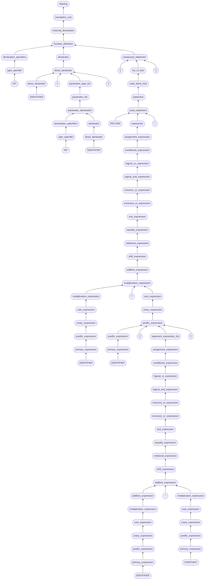

# ParseTreeGenerator
working...

From this
```c
int facto(int n)
{
    return n * facto(n - 1);
}
```

To this

```mermaid
    flowchart BT
    node2_0(["Starting"])
    node7_10(["INT"])
    node12_29(["type_specifier"])
    node19_27(["declaration_specifiers"])
    node23_1(["IDENTIFIER"])
    node30_35(["direct_declarator"])
    node34_68(["'('"])
    node39_10(["INT"])
    node44_29(["type_specifier"])
    node51_157(["declaration_specifiers"])
    node55_1(["IDENTIFIER"])
    node62_35(["direct_declarator"])
    node68_248(["declarator"])
    node74_160(["parameter_declaration"])
    node79_159(["parameter_list"])
    node85_158(["parameter_type_list"])
    node89_252(["')'"])
    node97_35(["direct_declarator"])
    node104_57(["declarator"])
    node108_63(["'{'"])
    node113_135(["RETURN"])
    node118_74(["IDENTIFIER"])
    node123_88(["primary_expression"])
    node128_89(["postfix_expression"])
    node135_138(["unary_expression"])
    node141_92(["cast_expression"])
    node146_93(["multiplicative_expression"])
    node150_179(["'*'"])
    node155_74(["IDENTIFIER"])
    node160_88(["primary_expression"])
    node165_89(["postfix_expression"])
    node170_175(["'('"])
    node175_74(["IDENTIFIER"])
    node180_88(["primary_expression"])
    node185_89(["postfix_expression"])
    node192_138(["unary_expression"])
    node198_92(["cast_expression"])
    node203_93(["multiplicative_expression"])
    node209_94(["additive_expression"])
    node213_183(["'-'"])
    node218_75(["CONSTANT"])
    node223_88(["primary_expression"])
    node228_89(["postfix_expression"])
    node235_90(["unary_expression"])
    node240_92(["cast_expression"])
    node245_273(["multiplicative_expression"])
    node253_94(["additive_expression"])
    node259_95(["shift_expression"])
    node265_96(["relational_expression"])
    node271_97(["equality_expression"])
    node277_98(["and_expression"])
    node283_99(["exclusive_or_expression"])
    node289_100(["inclusive_or_expression"])
    node295_101(["logical_and_expression"])
    node301_102(["logical_or_expression"])
    node307_139(["conditional_expression"])
    node312_266(["assignment_expression"])
    node317_265(["argument_expression_list"])
    node321_323(["')'"])
    node329_89(["postfix_expression"])
    node336_90(["unary_expression"])
    node341_269(["cast_expression"])
    node348_93(["multiplicative_expression"])
    node354_94(["additive_expression"])
    node360_95(["shift_expression"])
    node366_96(["relational_expression"])
    node372_97(["equality_expression"])
    node378_98(["and_expression"])
    node384_99(["exclusive_or_expression"])
    node390_100(["inclusive_or_expression"])
    node396_101(["logical_and_expression"])
    node402_102(["logical_or_expression"])
    node408_139(["conditional_expression"])
    node413_140(["assignment_expression"])
    node418_229(["expression"])
    node422_307(["';'"])
    node429_151(["jump_statement"])
    node434_143(["statement"])
    node439_147(["code_block_lists"])
    node444_146(["list_of_lists"])
    node449_244(["'}'"])
    node456_116(["compound_statement"])
    node463_43(["function_definition"])
    node468_42(["external_declaration"])
    node473_38(["translation_unit"])
    node7_10 --> node12_29
    node12_29 --> node19_27
    node19_27 --> node463_43
    node23_1 --> node30_35
    node30_35 --> node97_35
    node34_68 --> node97_35
    node39_10 --> node44_29
    node44_29 --> node51_157
    node51_157 --> node74_160
    node55_1 --> node62_35
    node62_35 --> node68_248
    node68_248 --> node74_160
    node74_160 --> node79_159
    node79_159 --> node85_158
    node85_158 --> node97_35
    node89_252 --> node97_35
    node97_35 --> node104_57
    node104_57 --> node463_43
    node108_63 --> node456_116
    node113_135 --> node429_151
    node118_74 --> node123_88
    node123_88 --> node128_89
    node128_89 --> node135_138
    node135_138 --> node141_92
    node141_92 --> node146_93
    node146_93 --> node348_93
    node150_179 --> node348_93
    node155_74 --> node160_88
    node160_88 --> node165_89
    node165_89 --> node329_89
    node170_175 --> node329_89
    node175_74 --> node180_88
    node180_88 --> node185_89
    node185_89 --> node192_138
    node192_138 --> node198_92
    node198_92 --> node203_93
    node203_93 --> node209_94
    node209_94 --> node253_94
    node213_183 --> node253_94
    node218_75 --> node223_88
    node223_88 --> node228_89
    node228_89 --> node235_90
    node235_90 --> node240_92
    node240_92 --> node245_273
    node245_273 --> node253_94
    node253_94 --> node259_95
    node259_95 --> node265_96
    node265_96 --> node271_97
    node271_97 --> node277_98
    node277_98 --> node283_99
    node283_99 --> node289_100
    node289_100 --> node295_101
    node295_101 --> node301_102
    node301_102 --> node307_139
    node307_139 --> node312_266
    node312_266 --> node317_265
    node317_265 --> node329_89
    node321_323 --> node329_89
    node329_89 --> node336_90
    node336_90 --> node341_269
    node341_269 --> node348_93
    node348_93 --> node354_94
    node354_94 --> node360_95
    node360_95 --> node366_96
    node366_96 --> node372_97
    node372_97 --> node378_98
    node378_98 --> node384_99
    node384_99 --> node390_100
    node390_100 --> node396_101
    node396_101 --> node402_102
    node402_102 --> node408_139
    node408_139 --> node413_140
    node413_140 --> node418_229
    node418_229 --> node429_151
    node422_307 --> node429_151
    node429_151 --> node434_143
    node434_143 --> node439_147
    node439_147 --> node444_146
    node444_146 --> node456_116
    node449_244 --> node456_116
    node456_116 --> node463_43
    node463_43 --> node468_42
    node468_42 --> node473_38
    node473_38 --> node2_0
```
